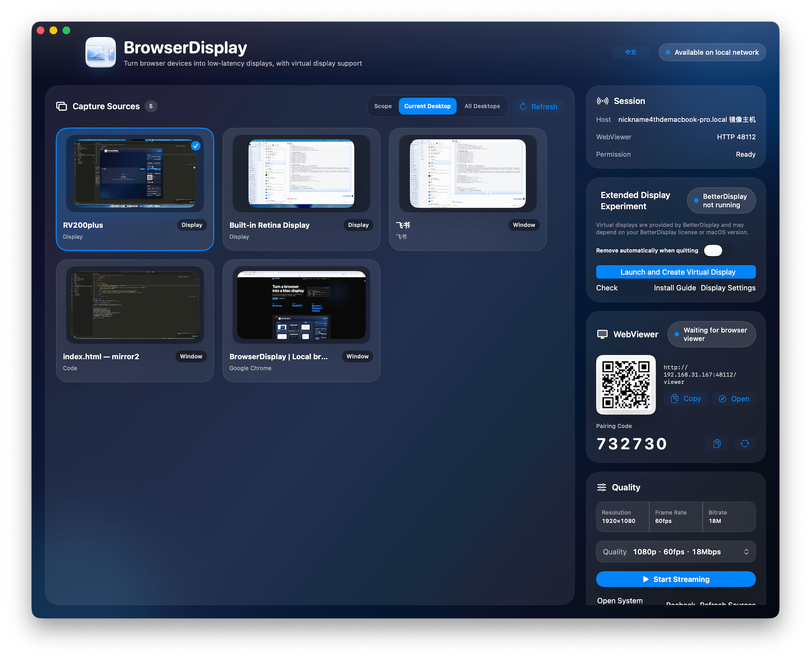

# BrowserDisplay

[中文](README_CN.md)

Turn a browser device on your local network into a temporary display for your Mac.

BrowserDisplay is a macOS app that captures a screen, window, or dedicated virtual display on the Mac and streams it to a browser over WebRTC. The receiving device does not need a native app. Open the WebViewer URL and connect.



## Highlights

- Capture a Mac screen, app window, or dedicated BrowserDisplay virtual display
- Stream video to browser devices over WebRTC
- Open WebViewer by QR code or URL
- Switch quality presets based on network conditions
- Optional BetterDisplay-powered virtual display mode
- Manage source selection, ports, pairing, connection state, and quality in one app

## Use Cases

- Use a phone, tablet, or another computer as a temporary side display
- Share only one window or a clean virtual workspace during presentations
- Move logs, chat, preview windows, or debugging panels to a nearby device
- Build a local display link without installing anything on the receiver

## Requirements

- macOS 14 or later
- Xcode with the macOS SDK and Swift toolchain
- A modern browser with WebRTC support on the receiving device
- BetterDisplay for the optional virtual display mode

## Quick Start

```bash
./tools/run-browserdisplay.command
```

On first launch, macOS will ask for Screen Recording permission. Grant it, then relaunch BrowserDisplay.

To reset the Screen Recording permission prompt:

```bash
./tools/reset-screen-recording.command
```

You can also open the workspace directly:

```bash
open BrowserDisplay.xcworkspace
```

Select the `BrowserDisplay` scheme and run it from Xcode.

## How It Works

1. Launch BrowserDisplay on the Mac.
2. Select a screen, window, or virtual display as the source.
3. Open the WebViewer URL on a browser device, or scan the QR code shown in the app.
4. Choose a quality preset.
5. Start streaming.

## Virtual Display Mode

The virtual display mode depends on BetterDisplay. BrowserDisplay creates a virtual display named `BrowserDisplay-xxxx`, captures it, and streams it to WebViewer.

This is useful for presentations, streaming, and meetings where you want to isolate exactly what the receiver can see.

## Documentation Site

The static documentation site lives in `docs/` and is ready for GitHub Pages:

```text
docs/index.html
docs/styles.css
docs/script.js
docs/assets/app-window-en.png
```

For GitHub Pages, set the Pages source directory to `docs/`.

## Repository Layout

```text
BrowserDisplay.xcworkspace       Xcode workspace
BrowserDisplay.xcodeproj         macOS app project
BrowserDisplay/                  BrowserDisplay app source
Shared/                          Shared Swift package
docs/                            GitHub Pages documentation site
tools/                           Local build and permission helper scripts
```
