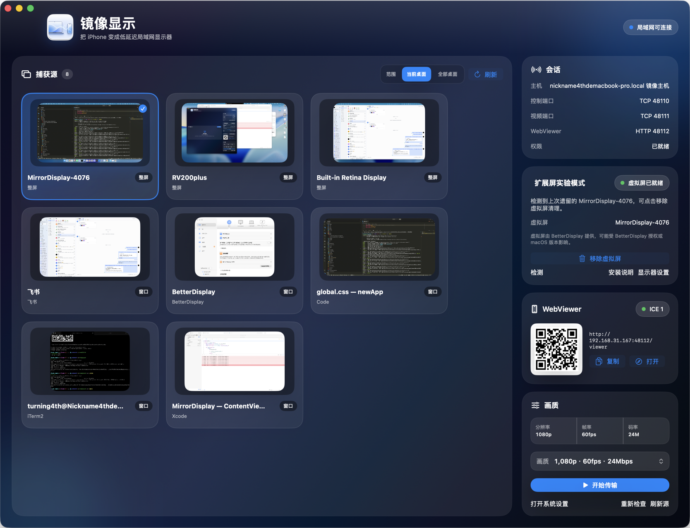

# BrowserDisplay

[English](README.md)

把同一局域网里的浏览器设备变成 Mac 的临时显示器。

BrowserDisplay 是一个 macOS 应用：在 Mac 上选择屏幕、窗口或专用虚拟屏，通过 WebRTC 把画面推送到同网段的浏览器。接收端不需要安装 App，只要打开 WebViewer 地址即可。



## 功能亮点

- 捕获 Mac 屏幕、窗口或 BrowserDisplay 专用虚拟屏
- 通过 WebRTC 向浏览器设备传输画面
- WebViewer 支持扫码或输入地址打开
- 内置画质预设，可按网络状况切换分辨率、帧率和码率
- 可选 BetterDisplay 虚拟屏模式，把需要展示的内容放到独立工作区
- 连接状态、端口、配对码和画质集中在一个窗口管理

## 适合场景

- 把手机、平板或另一台电脑临时当作副屏
- 演示时只共享某个窗口或专用虚拟屏
- 把日志、聊天、预览窗口或调试面板放到旁边设备
- 在本地网络内快速搭一个无需安装接收端的显示链路

## 系统要求

- macOS 14 或更新版本
- Xcode，带 macOS SDK 和 Swift 工具链
- 接收设备需要支持 WebRTC 的现代浏览器
- 虚拟屏功能需要安装 BetterDisplay

## 快速开始

```bash
./tools/run-browserdisplay.command
```

首次运行时，macOS 会要求授予屏幕录制权限。授权后重新运行脚本或重新打开应用。

如果需要重新触发屏幕录制授权：

```bash
./tools/reset-screen-recording.command
```

也可以直接用 Xcode 打开：

```bash
open BrowserDisplay.xcworkspace
```

选择 `BrowserDisplay` scheme 后运行。

## 使用方法

1. 打开 BrowserDisplay。
2. 在捕获源中选择屏幕、窗口或虚拟屏。
3. 在接收设备浏览器中打开 WebViewer 地址，或扫描应用中显示的二维码。
4. 按需要选择画质预设。
5. 点击开始传输。

## 虚拟屏模式

虚拟屏模式由 BetterDisplay 提供。BrowserDisplay 会创建一块名为 `BrowserDisplay-xxxx` 的虚拟显示器，捕获这块显示器并发送到 WebViewer。

适合在演示、直播或会议中隔离内容：只把需要展示的窗口拖到虚拟屏，避免暴露主屏上的其它内容。

## 文档站

静态文档在 `docs/` 目录，可以直接用于 GitHub Pages：

```text
docs/index.html
docs/styles.css
docs/script.js
docs/assets/app-window.png
```

发布到 GitHub Pages 时，选择 `docs/` 作为 Pages 目录即可。

## 项目结构

```text
BrowserDisplay.xcworkspace       Xcode workspace
BrowserDisplay.xcodeproj         macOS app project
BrowserDisplay/                  BrowserDisplay app source
Shared/                          Shared Swift package
docs/                            GitHub Pages documentation site
tools/                           Local build and permission helper scripts
```
